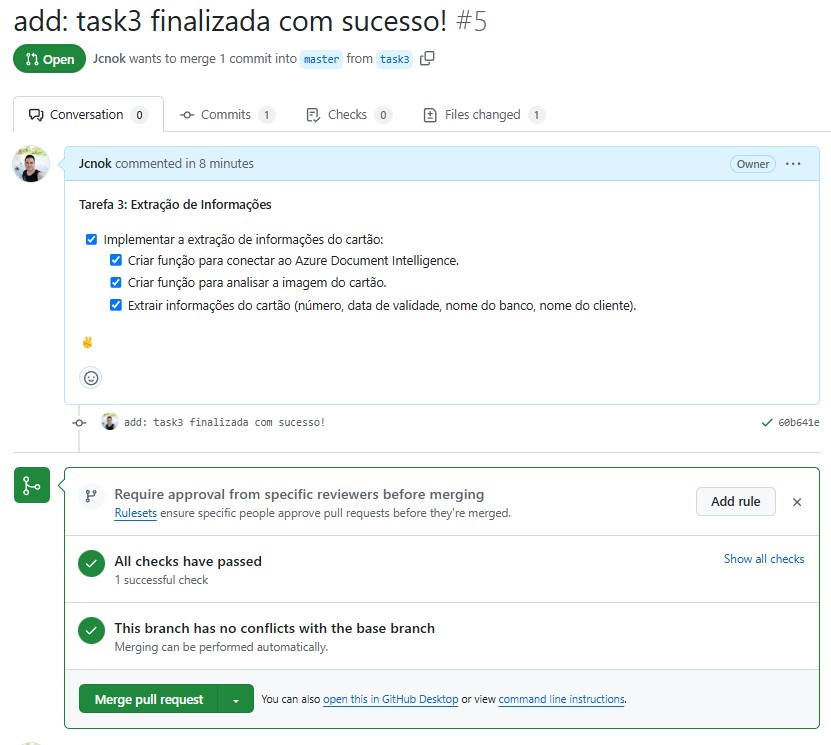
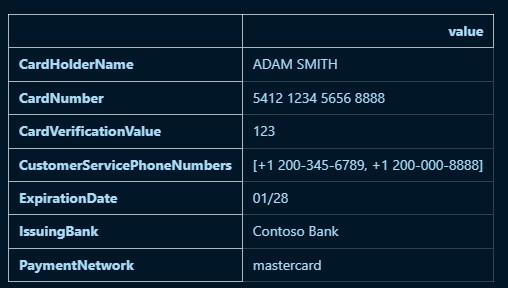

# Task 3:

**Tarefa 3: Extração de Informações**

* [ ] Implementar a extração de informações do cartão:
    * [ ] Criar função para conectar ao Azure Document Intelligence.
    * [ ] Criar função para analisar a imagem do cartão.
    * [ ] Extrair informações do cartão (número, data de validade, nome do banco, nome do cliente).

## Implementar a extração de informações do cartão:

### Criar função para conectar ao Azure Document Intelligence.

**Borá lá na documentação?** 
**[Documentação](https://learn.microsoft.com/en-us/azure/ai-services/document-intelligence/quickstarts/get-started-sdks-rest-api?view=doc-intel-4.0.0&pivots=programming-language-python)**

* **Primeiro como de costume, vamos carregar as variáveis da Config.py.**:


```python
from src.utils.Config import Config
```

* **Caregar a lib para conexão com a API do Documente Intelligence:**


```python
from azure.core.credentials import AzureKeyCredential
from azure.ai.documentintelligence import DocumentIntelligenceClient
from azure.ai.documentintelligence.models import AnalyzeDocumentRequest
```

* **Vamos criar uma conexão de teste.**


```python
credential = AzureKeyCredential(Config.KEY) 
document_client = DocumentIntelligenceClient(Config.ENDPOINT, credential) 
```

* **Agora vamos realizar a primeira analise:**


```python
card_info = document_client.begin_analyze_document(model_id="prebuilt-creditCard",analyze_request=AnalyzeDocumentRequest(url_source="https://documentintelligence.ai.azure.com/documents/samples/prebuilt/credit-card-horizontal.png"))
```

* **Vamos analisar esse cartão:**


* **Vamos verificar os resultados obtidos da imagem do cartão de exemplo:**


```python
card_info.result().documents[0]
```


    {'docType': 'creditCard', 'boundingRegions': [{'pageNumber': 1, 'polygon': [0, 0, 896, 0, 896, 1120, 0, 1120]}], 'fields': {'CardHolderName': {'type': 'string', 'content': 'ADAM SMITH', 'boundingRegions': [{'pageNumber': 1, 'polygon': [167, 445, 365, 446, 365, 481, 167, 480]}], 'confidence': 0.995, 'spans': [{'offset': 50, 'length': 10}]}, 'CardNumber': {'type': 'string', 'content': '5412 1234 5656 8888', 'boundingRegions': [{'pageNumber': 1, 'polygon': [166, 313, 715, 313, 715, 357, 166, 357]}], 'confidence': 0.995, 'spans': [{'offset': 13, 'length': 19}]}, 'CardVerificationValue': {'type': 'string', 'content': '123', 'boundingRegions': [{'pageNumber': 1, 'polygon': [544, 784, 586, 785, 586, 811, 544, 810]}], 'confidence': 0.995, 'spans': [{'offset': 134, 'length': 3}]}, 'CustomerServicePhoneNumbers': {'type': 'array', 'valueArray': [{'type': 'string', 'valueString': '+1 200-345-6789', 'content': '+1 200-345-6789', 'boundingRegions': [{'pageNumber': 1, 'polygon': [324, 610, 447, 610, 447, 627, 324, 627]}], 'spans': [{'offset': 99, 'length': 15}]}, {'type': 'string', 'valueString': '+1 200-000-8888', 'content': '+1 200-000-8888', 'boundingRegions': [{'pageNumber': 1, 'polygon': [471, 610, 594, 610, 594, 627, 471, 627]}], 'spans': [{'offset': 118, 'length': 15}]}]}, 'ExpirationDate': {'type': 'date', 'content': '01/28', 'boundingRegions': [{'pageNumber': 1, 'polygon': [227, 391, 319, 391, 319, 424, 226, 424]}], 'confidence': 0.995, 'spans': [{'offset': 39, 'length': 5}]}, 'IssuingBank': {'type': 'string', 'content': 'Contoso Bank', 'boundingRegions': [{'pageNumber': 1, 'polygon': [170, 172, 475, 171, 475, 213, 170, 214]}], 'confidence': 0.995, 'spans': [{'offset': 0, 'length': 12}]}, 'PaymentNetwork': {'type': 'string', 'content': 'mastercard', 'boundingRegions': [{'pageNumber': 1, 'polygon': [632, 464, 717, 463, 717, 477, 632, 477]}], 'confidence': 0.991, 'spans': [{'offset': 61, 'length': 10}]}}, 'confidence': 1, 'spans': [{'offset': 0, 'length': 306}]}


* **Funcionou, porém ele está trazendo muitas inforamções que são desnecessárias para o projeto, precisamos fazer alguns cortes.**


```python
card_info.result().documents[0].get('fields',{})
```


    {'CardHolderName': {'type': 'string', 'content': 'ADAM SMITH', 'boundingRegions': [{'pageNumber': 1, 'polygon': [167, 445, 365, 446, 365, 481, 167, 480]}], 'confidence': 0.995, 'spans': [{'offset': 50, 'length': 10}]},
     'CardNumber': {'type': 'string', 'content': '5412 1234 5656 8888', 'boundingRegions': [{'pageNumber': 1, 'polygon': [166, 313, 715, 313, 715, 357, 166, 357]}], 'confidence': 0.995, 'spans': [{'offset': 13, 'length': 19}]},
     'CardVerificationValue': {'type': 'string', 'content': '123', 'boundingRegions': [{'pageNumber': 1, 'polygon': [544, 784, 586, 785, 586, 811, 544, 810]}], 'confidence': 0.995, 'spans': [{'offset': 134, 'length': 3}]},
     'CustomerServicePhoneNumbers': {'type': 'array', 'valueArray': [{'type': 'string', 'valueString': '+1 200-345-6789', 'content': '+1 200-345-6789', 'boundingRegions': [{'pageNumber': 1, 'polygon': [324, 610, 447, 610, 447, 627, 324, 627]}], 'spans': [{'offset': 99, 'length': 15}]}, {'type': 'string', 'valueString': '+1 200-000-8888', 'content': '+1 200-000-8888', 'boundingRegions': [{'pageNumber': 1, 'polygon': [471, 610, 594, 610, 594, 627, 471, 627]}], 'spans': [{'offset': 118, 'length': 15}]}]},
     'ExpirationDate': {'type': 'date', 'content': '01/28', 'boundingRegions': [{'pageNumber': 1, 'polygon': [227, 391, 319, 391, 319, 424, 226, 424]}], 'confidence': 0.995, 'spans': [{'offset': 39, 'length': 5}]},
     'IssuingBank': {'type': 'string', 'content': 'Contoso Bank', 'boundingRegions': [{'pageNumber': 1, 'polygon': [170, 172, 475, 171, 475, 213, 170, 214]}], 'confidence': 0.995, 'spans': [{'offset': 0, 'length': 12}]},
     'PaymentNetwork': {'type': 'string', 'content': 'mastercard', 'boundingRegions': [{'pageNumber': 1, 'polygon': [632, 464, 717, 463, 717, 477, 632, 477]}], 'confidence': 0.991, 'spans': [{'offset': 61, 'length': 10}]}}


* **Vejam que as informações estão mais limpas, exemplo:**
* "CardHolderName": 
    * type -> tipo de dado
    * content -> valor do atributo
    * boundingRegions -> coordenadas de onde o resultado foi retirado da imagem.
    * confidence -> A confiança do modelo na extração do valor (quanto mais próximo de 1, mais preciso).
    * spans -> Informações sobre a localização do valor dentro do texto original.

* **O Ojetivo para esse exemplo é extrair apenas os atributos e valores dos resultados, mãos a obra.**


```python
card_fields = card_info.result().documents[0].get('fields',{})
type(card_fields)
```


    dict


* **Como se trata de um tipo de dicionário podemos percorrer chave e valor e extrair o necessário para o projeto.**


```python
card_fields['CardHolderName']['content']
```


    'ADAM SMITH'


```python
card_fields.values()
```


    dict_values([{'type': 'string', 'content': 'ADAM SMITH', 'boundingRegions': [{'pageNumber': 1, 'polygon': [167, 445, 365, 446, 365, 481, 167, 480]}], 'confidence': 0.995, 'spans': [{'offset': 50, 'length': 10}]}, {'type': 'string', 'content': '5412 1234 5656 8888', 'boundingRegions': [{'pageNumber': 1, 'polygon': [166, 313, 715, 313, 715, 357, 166, 357]}], 'confidence': 0.995, 'spans': [{'offset': 13, 'length': 19}]}, {'type': 'string', 'content': '123', 'boundingRegions': [{'pageNumber': 1, 'polygon': [544, 784, 586, 785, 586, 811, 544, 810]}], 'confidence': 0.995, 'spans': [{'offset': 134, 'length': 3}]}, {'type': 'array', 'valueArray': [{'type': 'string', 'valueString': '+1 200-345-6789', 'content': '+1 200-345-6789', 'boundingRegions': [{'pageNumber': 1, 'polygon': [324, 610, 447, 610, 447, 627, 324, 627]}], 'spans': [{'offset': 99, 'length': 15}]}, {'type': 'string', 'valueString': '+1 200-000-8888', 'content': '+1 200-000-8888', 'boundingRegions': [{'pageNumber': 1, 'polygon': [471, 610, 594, 610, 594, 627, 471, 627]}], 'spans': [{'offset': 118, 'length': 15}]}]}, {'type': 'date', 'content': '01/28', 'boundingRegions': [{'pageNumber': 1, 'polygon': [227, 391, 319, 391, 319, 424, 226, 424]}], 'confidence': 0.995, 'spans': [{'offset': 39, 'length': 5}]}, {'type': 'string', 'content': 'Contoso Bank', 'boundingRegions': [{'pageNumber': 1, 'polygon': [170, 172, 475, 171, 475, 213, 170, 214]}], 'confidence': 0.995, 'spans': [{'offset': 0, 'length': 12}]}, {'type': 'string', 'content': 'mastercard', 'boundingRegions': [{'pageNumber': 1, 'polygon': [632, 464, 717, 463, 717, 477, 632, 477]}], 'confidence': 0.991, 'spans': [{'offset': 61, 'length': 10}]}])


* **Vamos criar um novo dicionário vazio e a medida que vamos iterando sobre as chaves e valores vamos adicionar a chave e o valor de content no dicionário.**


```python
for chave, valor in card_fields.items():
    print(f"chave->{chave} : valor-> {valor}\n")
    
```

    chave->CardHolderName : valor-> {'type': 'string', 'content': 'ADAM SMITH', 'boundingRegions': [{'pageNumber': 1, 'polygon': [167, 445, 365, 446, 365, 481, 167, 480]}], 'confidence': 0.995, 'spans': [{'offset': 50, 'length': 10}]}
    
    chave->CardNumber : valor-> {'type': 'string', 'content': '5412 1234 5656 8888', 'boundingRegions': [{'pageNumber': 1, 'polygon': [166, 313, 715, 313, 715, 357, 166, 357]}], 'confidence': 0.995, 'spans': [{'offset': 13, 'length': 19}]}
    
    chave->CardVerificationValue : valor-> {'type': 'string', 'content': '123', 'boundingRegions': [{'pageNumber': 1, 'polygon': [544, 784, 586, 785, 586, 811, 544, 810]}], 'confidence': 0.995, 'spans': [{'offset': 134, 'length': 3}]}
    
    chave->CustomerServicePhoneNumbers : valor-> {'type': 'array', 'valueArray': [{'type': 'string', 'valueString': '+1 200-345-6789', 'content': '+1 200-345-6789', 'boundingRegions': [{'pageNumber': 1, 'polygon': [324, 610, 447, 610, 447, 627, 324, 627]}], 'spans': [{'offset': 99, 'length': 15}]}, {'type': 'string', 'valueString': '+1 200-000-8888', 'content': '+1 200-000-8888', 'boundingRegions': [{'pageNumber': 1, 'polygon': [471, 610, 594, 610, 594, 627, 471, 627]}], 'spans': [{'offset': 118, 'length': 15}]}]}
    
    chave->ExpirationDate : valor-> {'type': 'date', 'content': '01/28', 'boundingRegions': [{'pageNumber': 1, 'polygon': [227, 391, 319, 391, 319, 424, 226, 424]}], 'confidence': 0.995, 'spans': [{'offset': 39, 'length': 5}]}
    
    chave->IssuingBank : valor-> {'type': 'string', 'content': 'Contoso Bank', 'boundingRegions': [{'pageNumber': 1, 'polygon': [170, 172, 475, 171, 475, 213, 170, 214]}], 'confidence': 0.995, 'spans': [{'offset': 0, 'length': 12}]}
    
    chave->PaymentNetwork : valor-> {'type': 'string', 'content': 'mastercard', 'boundingRegions': [{'pageNumber': 1, 'polygon': [632, 464, 717, 463, 717, 477, 632, 477]}], 'confidence': 0.991, 'spans': [{'offset': 61, 'length': 10}]}
    


* **Temos um probleminha, a chave: `CustomerServicePhoneNumbers` possui um array com 2 valores:**


```python
card_fields['CustomerServicePhoneNumbers']['valueArray']
```


    [{'type': 'string', 'valueString': '+1 200-345-6789', 'content': '+1 200-345-6789', 'boundingRegions': [{'pageNumber': 1, 'polygon': [324, 610, 447, 610, 447, 627, 324, 627]}], 'spans': [{'offset': 99, 'length': 15}]},
     {'type': 'string', 'valueString': '+1 200-000-8888', 'content': '+1 200-000-8888', 'boundingRegions': [{'pageNumber': 1, 'polygon': [471, 610, 594, 610, 594, 627, 471, 627]}], 'spans': [{'offset': 118, 'length': 15}]}]


* **Certamente existem formas melhores de resolver isso, mas vou fazer o que me vem a mente no momento.**
* **Vou criar uma condição onde existir um "valueArray" irei extair o valor de 'content'.**


```python
#criar um dicionjário vazio:
result = {}
# percorrer sobre o dicionário
for key, value in card_fields.items():
    if "valueArray" in value:
        result[key] = [v['content'] for v in value["valueArray"]]
        # print(result)
    else:
        result[key] = value['content']
result
        
```


    {'CardHolderName': 'ADAM SMITH',
     'CardNumber': '5412 1234 5656 8888',
     'CardVerificationValue': '123',
     'CustomerServicePhoneNumbers': ['+1 200-345-6789', '+1 200-000-8888'],
     'ExpirationDate': '01/28',
     'IssuingBank': 'Contoso Bank',
     'PaymentNetwork': 'mastercard'}


* **Vamos usar o pandas somente pra exibir em formato de tabela:**


```python
import pandas as pd 
pd.DataFrame.from_dict(result, orient='index', columns=['value'])
```


<div>
<style scoped>
    .dataframe tbody tr th:only-of-type {
        vertical-align: middle;
    }

    .dataframe tbody tr th {
        vertical-align: top;
    }

    .dataframe thead th {
        text-align: right;
    }
</style>
<table border="1" class="dataframe">
  <thead>
    <tr style="text-align: right;">
      <th></th>
      <th>value</th>
    </tr>
  </thead>
  <tbody>
    <tr>
      <th>CardHolderName</th>
      <td>ADAM SMITH</td>
    </tr>
    <tr>
      <th>CardNumber</th>
      <td>5412 1234 5656 8888</td>
    </tr>
    <tr>
      <th>CardVerificationValue</th>
      <td>123</td>
    </tr>
    <tr>
      <th>CustomerServicePhoneNumbers</th>
      <td>[+1 200-345-6789, +1 200-000-8888]</td>
    </tr>
    <tr>
      <th>ExpirationDate</th>
      <td>01/28</td>
    </tr>
    <tr>
      <th>IssuingBank</th>
      <td>Contoso Bank</td>
    </tr>
    <tr>
      <th>PaymentNetwork</th>
      <td>mastercard</td>
    </tr>
  </tbody>
</table>
</div>


* **Agora vamos criar a função, esse literalmente é uma passo a passo, pois estou dividindo todo o processo em pequenos blocos pra facilitar o entendimento.**


```python
%%writefile src/services/credit_card_service.py
from src.utils.Config import Config
from azure.core.credentials import AzureKeyCredential
from azure.ai.documentintelligence import DocumentIntelligenceClient
from azure.ai.documentintelligence.models import AnalyzeDocumentRequest
import pandas as pd 

def detect_credit_card_info(card_url):
    """
    Extrai informações de um catão de crédito

    Args:
        card_url: url de uma imagem de cartão de crédito

    Return: 
        Um dataframe com as informações do cartão de crédito
    """
    credential = AzureKeyCredential(Config.KEY)
    document_client = DocumentIntelligenceClient(Config.ENDPOINT, credential)
    card_info = document_client.begin_analyze_document(
        "prebuilt-creditCard", AnalyzeDocumentRequest(url_source=card_url)
    )
    result = card_info.result()

    # Extract fields from the first document (assuming one card per image)
    fields = result.documents[0].get('fields', {})

    # Flatten the nested dictionary to a simple dictionary
    result = {}
    for key, value in fields.items():
        if 'valueArray' in value:
            # Handle arrays of values
            result[key] = [v['valueString'] for v in value['valueArray']]
        else:
            result[key] = value['content']

    # Create a Pandas DataFrame from the flattened dictionary
    df = pd.DataFrame.from_dict(result, orient='index', columns=['value'])

    return df
```

    Writing src/services/credit_card_service.py


```python
detect_credit_card_info("https://documentintelligence.ai.azure.com/documents/samples/prebuilt/credit-card-horizontal.png")
```


<div>
<style scoped>
    .dataframe tbody tr th:only-of-type {
        vertical-align: middle;
    }

    .dataframe tbody tr th {
        vertical-align: top;
    }

    .dataframe thead th {
        text-align: right;
    }
</style>
<table border="1" class="dataframe">
  <thead>
    <tr style="text-align: right;">
      <th></th>
      <th>value</th>
    </tr>
  </thead>
  <tbody>
    <tr>
      <th>CardHolderName</th>
      <td>ADAM SMITH</td>
    </tr>
    <tr>
      <th>CardNumber</th>
      <td>5412 1234 5656 8888</td>
    </tr>
    <tr>
      <th>CardVerificationValue</th>
      <td>123</td>
    </tr>
    <tr>
      <th>CustomerServicePhoneNumbers</th>
      <td>[+1 200-345-6789, +1 200-000-8888]</td>
    </tr>
    <tr>
      <th>ExpirationDate</th>
      <td>01/28</td>
    </tr>
    <tr>
      <th>IssuingBank</th>
      <td>Contoso Bank</td>
    </tr>
    <tr>
      <th>PaymentNetwork</th>
      <td>mastercard</td>
    </tr>
  </tbody>
</table>
</div>


* **Vamos verificar a qualidade e padronização do código.**


```python
!task format src/services/credit_card_service.py
```

    Fixing /home/jcnok/bootcamps/Bootcamp-Microsoft-Certification-Challenge--1-AI_102/desafios_de_projeto/desafio_2/src/services/credit_card_service.py
    Skipping .ipynb files as Jupyter dependencies are not installed.
    You can fix this by running ``pip install "black[jupyter]"``
    reformatted /home/jcnok/bootcamps/Bootcamp-Microsoft-Certification-Challenge--1-AI_102/desafios_de_projeto/desafio_2/src/services/credit_card_service.py
    
    All done! ✨ 🍰 ✨
    1 file reformatted, 3 files left unchanged.


All done! ✨ 🍰 ✨

* **Criar a branch para task3:**


```python
!git checkout -b task3
```

    Switched to a new branch 'task3'


* **Verificar se a branch task3 foi setada**:


```python
!git branch 
```

      master
      task1
      task2
    * task3


* **Adicionar ao stage e commitar:**


```python
!git add src/services/credit_card_service.py 
```


```python
!git commit -m "add: task3 finalizada com sucesso!"
```

    [task3 60b641e] add: task3 finalizada com sucesso!
     1 file changed, 40 insertions(+)
     create mode 100644 desafios_de_projeto/desafio_2/src/services/credit_card_service.py


* **Enviar para o repositório remoto github:**


```python
!git push origin task3
```

    Enumerating objects: 12, done.
    Counting objects: 100% (12/12), done.
    Delta compression using up to 24 threads
    Compressing objects: 100% (7/7), done.
    Writing objects: 100% (7/7), 1.20 KiB | 1.20 MiB/s, done.
    Total 7 (delta 2), reused 0 (delta 0), pack-reused 0
    remote: Resolving deltas: 100% (2/2), completed with 2 local objects.
    remote: 
    remote: Create a pull request for 'task3' on GitHub by visiting:
    remote:      https://github.com/Jcnok/Bootcamp-Microsoft-Certification-Challenge--1-AI_102/pull/new/task3
    remote: 
    To https://github.com/Jcnok/Bootcamp-Microsoft-Certification-Challenge--1-AI_102.git
     * [new branch]      task3 -> task3


* **Abrir a pull request da task3:**


       

* **Merge realizad com sucesso!:**


### Bom pessoal, agora falta criar a aplicação com streamlit, basicamente vamos usar todos os módulos para concluir o desafio até lá....🫡! 
### Se acharem que o conteúdo é de valia, agradeço o feedback e um voto de confiança... 🙏🏻 valeu...

